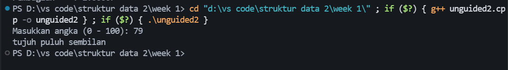
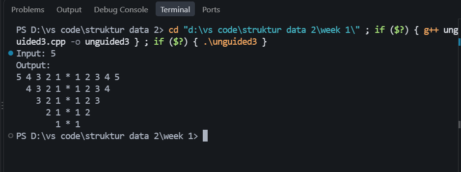

# <h1 align="center">Laporan Praktikum Modul 1 - Codeblocks IDE & Pengenalan Bahas C++ (Bagian Pertama)</h1>

Trisna Kusuma Ramadhany - 103312400277

## Dasar Teori
C++ merupakan bahasa pemrograman tingkat tinggi yang dapat digunakan untuk membuat berbagai jenis aplikasi. Dalam pembelajaran dasar pemrograman, C++ mencakup konsep variabel, tipe data, operator, input dan output, percabangan, serta perulangan. Konsep-konsep tersebut menjadi dasar dalam pembuatan program yang lebih kompleks.[1]

Dalam pemrograman C++, tipe data digunakan untuk menentukan jenis data yang dapat disimpan oleh suatu variabel. Salah satu tipe data yang digunakan adalah float, yaitu tipe data untuk menyimpan bilangan yang memiliki nilai pecahan. Selain itu, terdapat tipe data int untuk menyimpan bilangan bulat.[2]

## Unguided 

### 1. Program Operasi Dua Bilangan Float

### Output Unguided 1 :

##### Output 1

penjelasan unguided 1 :
Program ini digunakan untuk menerima dua bilangan bertipe float dari pengguna. Kedua bilangan tersebut kemudian diproses menggunakan operator aritmatika untuk menghasilkan penjumlahan, pengurangan, perkalian, dan pembagian. Percabangan if digunakan untuk memastikan bilangan kedua tidak bernilai 0 sebelum melakukan pembagian, sehingga program tidak melakukan pembagian dengan nol.

### 2. Buatlah sebuah program yang menerima masukan angka dan mengeluarkan output nilai angka tersebut dalam bentuk tulisan. Angka yang akan di-input-kan user adalah bilangan bulat positif mulai dari 0 sampai 100.

### source code unguided 2

### Output Unguided 2 :

penjelasan unguided 2 :
Program ini digunakan untuk mengubah angka dari 0 sampai 100 menjadi bentuk tulisan. Program menggunakan array `satuan` untuk menyimpan nama angka dari nol sampai sembilan. Percabangan `if-else` digunakan untuk menentukan bentuk tulisan berdasarkan angka yang dimasukkan. Operator `/` digunakan untuk menentukan nilai puluhan, sedangkan operator `%` digunakan untuk menentukan nilai satuan.

### 3. Buatlah program yang dapat memberikan input dan output sebagai berikut.

### source code unguided 3

### Output Unguided 3 :

### penjelasan unguided 3
Program ini digunakan untuk membuat pola mirror menggunakan perulangan `for`. Perulangan pertama digunakan untuk menentukan jumlah baris. Perulangan kedua digunakan untuk membuat spasi agar pola semakin bergeser ke kanan. Perulangan berikutnya digunakan untuk menampilkan angka secara menurun pada bagian kiri dan secara menaik pada bagian kanan. Simbol `*` digunakan sebagai bagian tengah pola.
## Kesimpulan
...
Berdasarkan praktikum yang telah dilakukan, dapat disimpulkan bahwa bahasa pemrograman C++ memiliki berbagai konsep dasar yang dapat digunakan untuk menyelesaikan permasalahan pemrograman sederhana. Pada praktikum ini, konsep yang diterapkan meliputi input dan output, tipe data, operator aritmatika, percabangan `if-else`, array, serta perulangan `for`.

Pada Unguided 1, program digunakan untuk menerima dua bilangan bertipe `float` dan melakukan operasi penjumlahan, pengurangan, perkalian, serta pembagian. Pada Unguided 2, program digunakan untuk mengubah bilangan dari 0 sampai 100 menjadi bentuk tulisan dengan memanfaatkan array dan percabangan. Sedangkan pada Unguided 3, perulangan digunakan untuk menghasilkan pola angka dan simbol berbentuk mirror.

Melalui ketiga tugas tersebut, dapat dipahami bahwa setiap konsep dasar dalam C++ memiliki fungsi yang berbeda dan dapat dikombinasikan untuk menghasilkan program sesuai kebutuhan. Praktikum ini juga membantu dalam memahami proses pembuatan program mulai dari menerima input, mengolah data, menggunakan struktur kontrol, hingga menghasilkan output yang sesuai dengan ketentuan soal.

## Referensi
[1] Triase. (2020). Diktat Edisi Revisi : STRUKTUR DATA. Medan: UNIVERSTAS ISLAM NEGERI SUMATERA UTARA MEDAN. 
 [2] Indahyati, Uce., Rahmawati Yunianita. (2020). "BUKU AJAR ALGORITMA DAN PEMROGRAMAN DALAM BAHASA C++". Sidoarjo: Umsida Press. Diakses pada 10 Maret 2024 melalui https://doi.org/10.21070/2020/978-623-6833-67-4.
 ...
