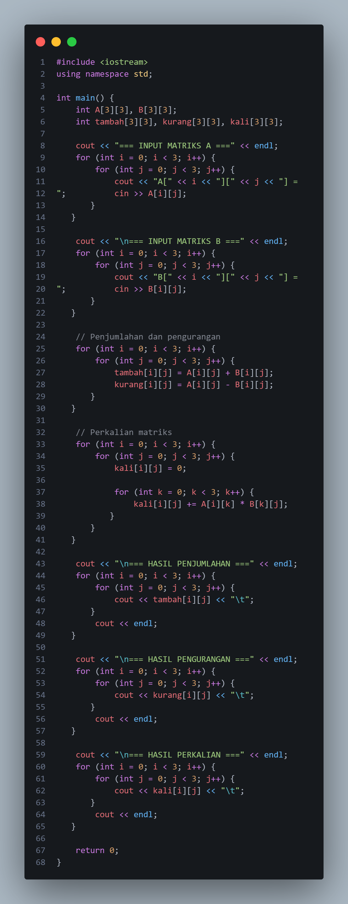
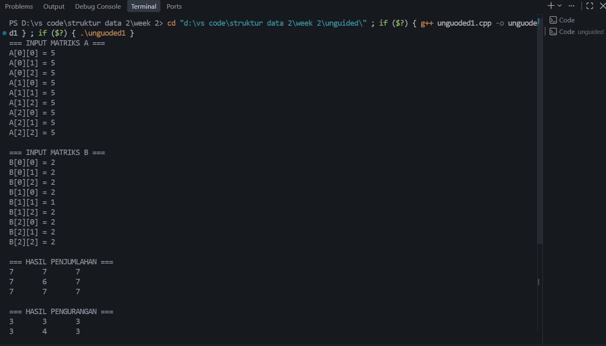
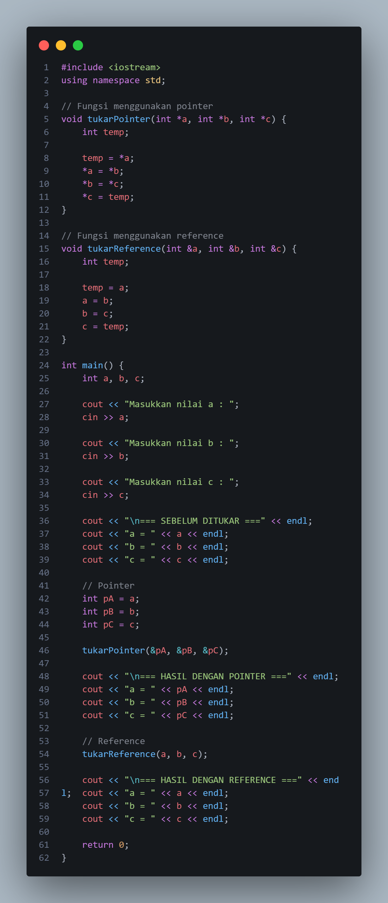
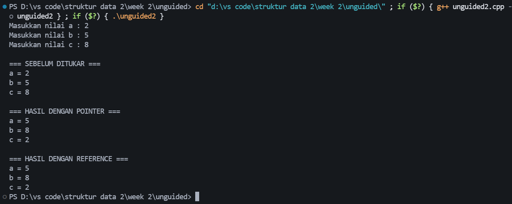
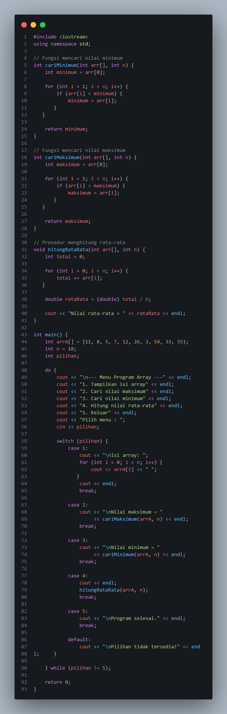
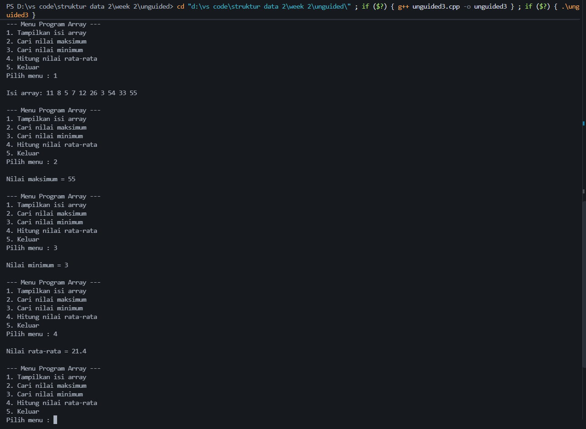

# <h1 align="center">Laporan Praktikum Modul 2 - Struktur Data</h1>

Trisna Kusuma Ramadhany - 103312400277

## Dasar Teori
Array merupakan struktur data yang digunakan untuk menyimpan kumpulan data dengan tipe yang sama dan dapat berupa satu atau dua dimensi. Array dua dimensi dapat digunakan untuk merepresentasikan matriks yang tersusun dari baris dan kolom. Pada praktikum ini, array digunakan untuk mengolah data dan melakukan operasi matriks.

Pointer adalah variabel yang menyimpan alamat memori variabel lain, sedangkan reference merupakan alias yang mengacu pada variabel yang sudah ada. Keduanya dapat digunakan untuk mengubah nilai variabel secara langsung, termasuk dalam proses pertukaran nilai.

Function merupakan bagian program yang digunakan untuk menjalankan tugas tertentu dan dapat mengembalikan nilai, sedangkan prosedur menggunakan void dan tidak mengembalikan nilai. Pada praktikum ini, function digunakan untuk mencari nilai minimum dan maksimum, sementara prosedur digunakan untuk menghitung rata-rata.

Switch-case merupakan struktur percabangan yang digunakan untuk memilih salah satu dari beberapa pilihan berdasarkan nilai tertentu. Pada praktikum ini, switch-case digunakan untuk membuat menu pengolahan array seperti menampilkan array, mencari nilai minimum dan maksimum, serta menghitung rata-rata.

## Guided 

### 1. array 1

program C++ yang bertujuan untuk mendeklarasikan sebuah variabel bernama nilai dan melakukan pengecekan terhadap nilai tersebut. #include <iostream> digunakan untuk menyediakan fungsi input dan output, sedangkan using namespace std mempermudah penggunaan perintah dari library standar C++. Namun, penulisan int nilai($); dan nilai(0) < 60 masih salah secara sintaks. Seharusnya variabel dideklarasikan dengan int nilai;, kemudian pengecekan nilai kurang dari 60 dilakukan menggunakan kondisi if, yaitu if (nilai < 60).

### 2. array 2

Program tersebut digunakan untuk menyimpan dan menampilkan data nilai dalam bentuk array dua dimensi berukuran 3×3. Array nilai berisi sembilan data yang disusun dalam tiga baris dan tiga kolom. Perulangan for digunakan untuk mengakses setiap elemen array, dengan variabel i sebagai indeks baris dan j sebagai indeks kolom, kemudian setiap nilai ditampilkan menggunakan cout. Perintah cout << endl digunakan untuk membuat baris baru setelah setiap baris array selesai ditampilkan. Pada bagian akhir terdapat nilai[3][2], tetapi indeks tersebut berada di luar batas array karena indeks array 3×3 hanya dari 0 sampai 2. Oleh karena itu, perintah tersebut dapat menghasilkan nilai yang tidak valid.

### 3. array 3

Program tersebut digunakan untuk membuat dan mengakses array tiga dimensi dengan ukuran 2×2×3. Array data berisi dua kelompok data, masing-masing memiliki dua baris dan tiga kolom. Nilai-nilai tersebut kemudian diakses menggunakan indeks pada perintah data[0][1][2], yang berarti mengambil data pada kelompok pertama, baris kedua, dan kolom ketiga. Berdasarkan isi array, nilai yang diakses adalah 60, sehingga program akan menampilkan angka 60 pada layar.

### 4. alamat/address

Program tersebut digunakan untuk menampilkan nilai dan alamat memori dari sebuah variabel. Variabel angka bertipe integer diberikan nilai 100. Perintah cout pertama digunakan untuk menampilkan nilai dari variabel tersebut, sedangkan &angka digunakan untuk mendapatkan dan menampilkan alamat memori tempat variabel angka disimpan. Dengan demikian, program ini menunjukkan perbedaan antara nilai suatu variabel dan alamat memori variabel tersebut, yang merupakan konsep dasar dalam penggunaan pointer.

### 5. pointer

Program tersebut digunakan untuk membuat dan mengakses array karakter. Variabel arr dideklarasikan sebagai array bertipe char dengan 6 elemen, kemudian setiap indeks diisi dengan karakter mulai dari A hingga F. Perintah cout << arr[3] digunakan untuk menampilkan karakter pada indeks ke-3, yaitu D. Sementara itu, cout << &arr[4] digunakan untuk menampilkan alamat memori dari elemen array pada indeks ke-4, yaitu karakter E. Program ini menunjukkan penggunaan indeks array sekaligus konsep alamat memori pada array karakter.
### 6. function

Program tersebut digunakan untuk memahami konsep pointer dalam bahasa C++. Variabel angka menyimpan nilai 100, kemudian variabel pointer dideklarasikan sebagai pointer bertipe int dan diisi dengan alamat memori dari variabel angka menggunakan operator &. Perintah cout pertama menampilkan nilai angka, sedangkan &angka menampilkan alamat memori variabel tersebut. Variabel pointer juga menampilkan alamat yang sama karena pointer menyimpan alamat dari angka. Sementara itu, operator *pointer digunakan untuk mengambil nilai yang terdapat pada alamat tersebut sehingga menghasilkan nilai 100. Dengan demikian, program ini menunjukkan hubungan antara variabel, alamat memori, pointer, dan nilai yang ditunjuk oleh pointer.

### 7. procedure

Program tersebut digunakan untuk mencari nilai terbesar dari tiga bilangan menggunakan sebuah fungsi bernama max3. Fungsi max3 menerima tiga parameter yaitu a, b, dan c, kemudian membandingkan ketiga nilai tersebut untuk menentukan nilai yang paling besar dan menyimpannya pada variabel terbesar. Pada fungsi main, pengguna diminta memasukkan tiga nilai yang disimpan dalam variabel x, y, dan z. Ketiga nilai tersebut kemudian dikirim ke fungsi max3, dan hasil nilai terbesar ditampilkan menggunakan cout. Program ini menunjukkan penggunaan fungsi, parameter, percabangan if, input pengguna, dan nilai kembalian (return) dalam bahasa C++.

### 8. call by value/pointer/reference

Program tersebut digunakan untuk menukar nilai dari dua variabel menggunakan reference. Fungsi tukar menerima dua parameter a dan b dengan tanda &, sehingga parameter tersebut menjadi reference yang langsung mengacu pada variabel asli. Variabel sementara temp digunakan untuk menyimpan nilai a sebelum ditukar, kemudian nilai b diberikan ke a, dan nilai temp diberikan ke b. Pada fungsi main, variabel x bernilai 10 dan y bernilai 20, kemudian keduanya dikirim ke fungsi tukar. Setelah fungsi dijalankan, nilai x menjadi 20 dan nilai y menjadi 10. Program ini menunjukkan penggunaan reference, fungsi, parameter, dan variabel sementara dalam proses pertukaran nilai.

## Unguided 

### 1. Penjumlahan, Pengurangan, dan Perkalian Matriks 3×3

### Output Unguided

Program tersebut digunakan untuk melakukan operasi penjumlahan, pengurangan, dan perkalian dua matriks berukuran 3×3. Pada awal program, array A dan B digunakan untuk menyimpan nilai kedua matriks, sedangkan array tambah, kurang, dan kali digunakan untuk menyimpan hasil dari masing-masing operasi. Dua perulangan for digunakan untuk meminta pengguna memasukkan setiap elemen matriks A dan B. Setelah itu, penjumlahan dilakukan dengan menjumlahkan elemen yang memiliki posisi baris dan kolom yang sama, sedangkan pengurangan dilakukan dengan mengurangkan elemen matriks A dengan matriks B pada posisi yang sama.

Untuk perkalian matriks, digunakan tiga perulangan for, yaitu i untuk baris matriks A, j untuk kolom matriks B, dan k untuk melakukan proses perkalian serta penjumlahan setiap elemen. Variabel kali[i][j] terlebih dahulu diberi nilai 0, kemudian hasil perkalian setiap elemen ditambahkan ke dalamnya. Setelah seluruh proses selesai, tiga pasang perulangan for digunakan untuk menampilkan hasil penjumlahan, pengurangan, dan perkalian matriks. Program ini menerapkan konsep array dua dimensi, perulangan, input-output, serta operasi dasar matriks dalam C++.

### 2. Menukar Nilai 3 Variabel dengan Pointer dan Reference

Program tersebut digunakan untuk menukar nilai dari tiga variabel menggunakan pointer dan reference. Fungsi tukarPointer menggunakan parameter bertipe pointer (int *) sehingga dapat mengakses nilai asli melalui operator *, kemudian nilai a, b, dan c ditukar menggunakan variabel sementara temp. Sementara itu, fungsi tukarReference menggunakan parameter reference (int &) yang langsung mengacu pada variabel aslinya sehingga nilai dapat ditukar secara langsung. Pada fungsi main, pengguna memasukkan tiga nilai yang disimpan pada variabel a, b, dan c, kemudian nilai tersebut ditampilkan sebelum ditukar. Untuk pengujian pointer digunakan variabel pA, pB, dan pC yang merupakan salinan dari nilai awal, lalu dikirim ke tukarPointer menggunakan alamatnya dengan operator &. Setelah itu, variabel a, b, dan c ditukar menggunakan fungsi tukarReference. Dengan demikian, program ini menunjukkan perbedaan penggunaan pointer dan reference dalam proses pertukaran nilai tiga variabel.

### 3. Array — Minimum, Maksimum, dan Rata-rata

Program tersebut digunakan untuk mengolah data array dengan menyediakan menu untuk menampilkan isi array, mencari nilai maksimum, mencari nilai minimum, dan menghitung nilai rata-rata. Fungsi cariMinimum digunakan untuk mencari nilai terkecil dengan membandingkan setiap elemen array, sedangkan fungsi cariMaksimum digunakan untuk mencari nilai terbesar. Sementara itu, prosedur hitungRataRata menjumlahkan seluruh elemen array menggunakan perulangan kemudian membaginya dengan jumlah data untuk mendapatkan nilai rata-rata.

Pada fungsi main, array arrA berisi 10 nilai, yaitu 11, 8, 5, 7, 12, 26, 3, 54, 33, dan 55. Variabel n digunakan untuk menyatakan jumlah elemen array. Program menggunakan perulangan do-while agar menu terus ditampilkan sampai pengguna memilih pilihan 5 untuk keluar. Struktur switch-case digunakan untuk menjalankan proses sesuai pilihan pengguna, yaitu menampilkan array, mencari nilai maksimum, mencari nilai minimum, atau menghitung rata-rata. Jika pengguna memasukkan pilihan yang tidak tersedia, program akan menampilkan pesan bahwa pilihan tidak tersedia. Dengan demikian, program ini menerapkan konsep array, function, procedure, perulangan, dan switch-case dalam pengolahan data.

## Kesimpulan
Berdasarkan praktikum Struktur Data Modul 2, dapat disimpulkan bahwa bahasa pemrograman C++ dapat digunakan untuk mengolah berbagai bentuk data dengan memanfaatkan konsep array, matriks, pointer, reference, function, procedure, percabangan, dan perulangan. Pada praktikum ini, array dua dimensi digunakan untuk menyimpan dan melakukan operasi pada matriks 3×3, seperti penjumlahan, pengurangan, dan perkalian. Selain itu, konsep pointer dan reference digunakan untuk mengakses serta mengubah nilai variabel, termasuk melakukan pertukaran nilai tiga variabel.

Praktikum juga menunjukkan penggunaan function untuk mencari nilai minimum dan maksimum serta procedure untuk menghitung nilai rata-rata dari sebuah array. Penggunaan switch-case dan perulangan do-while diterapkan untuk membuat menu program sehingga pengguna dapat memilih operasi yang ingin dilakukan. Dari keseluruhan praktikum, dapat dipahami bahwa penggunaan struktur data dan struktur kontrol dalam C++ membantu membuat program menjadi lebih terstruktur, mudah digunakan, dan mampu melakukan pengolahan data secara efektif.

## Referensi
[1] Triase. (2020). Diktat Edisi Revisi : STRUKTUR DATA. Medan: UNIVERSTAS ISLAM NEGERI SUMATERA UTARA MEDAN. 
 [2] Indahyati, Uce., Rahmawati Yunianita. (2020). "BUKU AJAR ALGORITMA DAN PEMROGRAMAN DALAM BAHASA C++". Sidoarjo: Umsida Press. Diakses pada 10 Maret 2024 melalui https://doi.org/10.21070/2020/978-623-6833-67-4.
 ...
